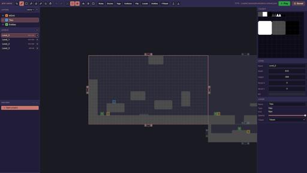

# pixi-vania

[English](README.md) | [한국어](README.ko.md)



**(WIP)** An LDtk-style level editor and runtime for PixiJS.

- Mount the editor anywhere inside your app
- Save JSON projects to disk through a Vite plugin
- Auto-tiling with randomized X/Y flips and pixel jitter
- View and edit multiple levels at once on an infinite canvas
- Add custom level data with entities
- Edit collision shapes and tags for individual tiles
- Rapier integration
- Dialogue editor and localization table

```sh
npm i pixi-vania pixi.js @dimforge/rapier2d-compat
```

Rapier is optional if you only need rendering.

## Quick start

Mount the editor in any `<div>`. It includes its own Svelte runtime and styles.

```ts
import { mountEditor } from 'pixi-vania/editor';

const editor = mountEditor(document.querySelector('#editor')!, {
	projectPath: '/assets/levels/demo.svlevel.json',
	onPlay: (project, levelUid) => startGame(project, levelUid)
});
```

Passing `onPlay` adds a Play button and sends the current in-memory project straight to your game. See the [editor guide](docs/editor.md) for the full UI reference.

To save files during `vite dev`, add the Vite plugin. Without it, the editor still supports browser import and export.

```ts
// vite.config.ts
import levelEditor from 'pixi-vania/vite';

export default { plugins: [levelEditor({ staticDir: 'public' })] };
```

Load a level with `createLevelRuntime`:

```ts
import RAPIER from '@dimforge/rapier2d-compat';
import { createLevelRuntime } from 'pixi-vania';

await RAPIER.init();
const world = new RAPIER.World({ x: 0, y: 40 });

const level = await createLevelRuntime(project, levelUid, {
	world,
	stage: app.stage,
	basePath: '/assets/levels/demo.svlevel.json',
	navGrid: true
});
```

This creates the tile meshes, static colliders, and entity list. Your game remains responsible for spawning entities:

```ts
for (const entity of level.entities) {
	if (entity.instance.type === 'PlayerStart') {
		body.setTranslation({ x: entity.world[0], y: entity.world[1] }, true);
	}
}

level.destroy();
```

Pixi and Rapier use the same Y-down coordinate system. Rendering uses pixels; physics uses `pixels / pixelsPerUnit`. By default, `pixelsPerUnit` is `project.defaultGridSize`, so one tile is one physics unit.

## Runtime notes

### Collision layers

Collision layers map to Rapier's 16-bit interaction groups, so a project can have up to 16. `DEFAULT` uses bit 0, collides with every layer, and is used for unknown ids.

```ts
import { buildCollisionGroups, groupsForLayer } from 'pixi-vania';

const table = buildCollisionGroups(project.collisionLayers);
collider.setCollisionGroups(groupsForLayer(table, 'Enemy'));
```

### Tile colliders and tags

Each item in `level.colliders` contains the Rapier collider and its source rectangle. Adjacent box colliders with the same configuration are merged. Pixel-shaped colliders stay within their source tile.

```ts
for (const { collider, rect } of level.colliders) {
	if (rect.tags.includes('Ice')) collider.setFriction(0);
}
```

### Navigation grid

The optional navigation grid marks a cell as walkable when the cell is empty, the cell below is solid, and the cell above is empty. Connected components make reachability checks inexpensive.

```ts
const nav = level.navGrid!;
const from = nav.cellAt(px, py);
const to = nav.cellAt(tx, ty);
if (nav.connected(from, to)) walkTo(tx, ty);
```

### Entity fields

`entity.fields` combines instance values with the entity type's defaults. Fields added to a type after an instance was placed therefore still have a value.

Localized fields use the source string as their key and fall back to it when a translation is missing:

```ts
import { localize } from 'pixi-vania';

label.text = localize(project.localization, entity.fields.Name as string, 'ko');
```

Dialogue scripts are stored as JSON in a `Dialogue` field:

```ts
import { parseScript } from 'pixi-vania';

for (const line of parseScript(entity.fields.Script)) {
	say(line.speaker, line.text);
}
```

### Storage

The default `devServerStore()` uses the Vite plugin. `staticStore(paths)` loads with `fetch` and downloads JSON when saved. For custom storage, implement `ProjectStore` with `list`, `load`, `save`, and optional asset methods.

```ts
mountEditor(el, { store: staticStore(['/assets/levels/demo.svlevel.json']) });
```

## API reference

### `pixi-vania`

```ts
createLevelRuntime(project, levelId, options): Promise<LevelRuntime>

LevelRuntime {
	level
	container
	body
	colliders
	navGrid
	entities
	pixelsPerUnit
	destroy()
}

loadTilesetTextures(project, basePath?)
buildTileLayers(project, level, textures)
tileMaskFromTextures(project, textures)
createLevelBody(world, level, pixelsPerUnit)
createTileColliders(world, body, project, level, pixelsPerUnit, mask?)
tileColliderRects(project, level, mask?)
buildNavGrid(project, level, mask?)
tileBatches(project, layer)
tileTagIndex(tileset)
buildCollisionGroups(layers)
groupsForLayer(table, id)
interactionGroups(membership, filter?)
collisionTargetsFor(layers, id)
cloneDefaultLayers()
computeAutoTiles(options)
getEntityType(project, id)
getEntityTypeDef(project, id)
defaultEntityFields(project, id)
localize(localization, key, locale)
collectLocalizableStrings(project)
emptyLocalization()
parseScript(raw)
serializeScript(lines)
```

### `pixi-vania/editor`

```ts
mountEditor(target, options): EditorHandle

EditorHandle {
	getProject()
	open(project, path?)
	load(path?)
	save()
	destroy()
}

devServerStore(api?)
staticStore(paths?)
setProjectStore(store)
projectStore()
emptyProject()
```

Only one editor can be mounted per page because its store is a module singleton.

### `pixi-vania/vite`

```ts
levelEditor({
	staticDir?: string,       // default: 'public'
	base?: string,            // default: '/__svlevel'
	imageExtensions?: string[]
}): Plugin
```

The plugin exposes project listing, asset listing, saving, and uploading under `base`. All paths are confined to `staticDir`.

## Development

The tile shader currently requires WebGL, so initialize Pixi with `preference: 'webgl'`.

```sh
pnpm i
pnpm dev # http://localhost:8383
```

`packages/lib` contains the library and `packages/demo` is the development harness.

MIT
